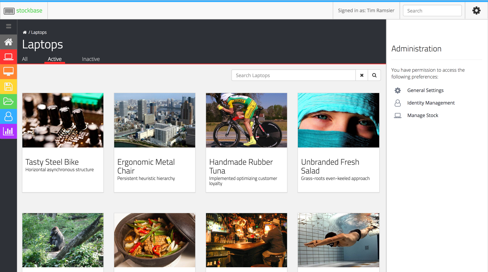

# stockbase

## Overview

**stockbase** is an "in-development" asset management system being designed to
be adaptive and easy to use.  It is being designed to track IT assets such as
laptops, desktops, and software.

## Usage

### Installation

To install **stockbase** simply clone the repository:

`git clone git@github.com:timramsier/asset-manager.git`

### Running

#### Docker Compose

If you have Docker Compose installed, you can use the included `runServer.sh`
script.  This will handle the creation of the necessary containers and
initialization of a MongoDB solution (via Docker).

##### Easy Way
The easy way to run this application is by running the `runServer.sh` which will
use the default `docker-compose.yml` file.  If you make changes to the source code,
you will need to

`bash runServer`

##### Development Way
If you want to run the application with the ability to make edits and have the
bundle update use the following commands.
1. `bash runServer --dev`
*  `APP_DATABASE_API_KEY=not-secure-api-key npm run watch`

This will start the server with the local front end files bind mounted into the
the front end container and then start **Webpack** watch on the local files,
updating the `styles.css` and `bundle.js` files as they are changed.

#### Rebuilding Container Images
If you need to rebuild the container images you can use the following command:
`bash runServer --build`

#### Local

#### :exclamation: Important - You will need to have [MongoDB](https://docs.mongodb.com/manual/installation/) installed locally to be able to run this application.

##### Starting the app

###### Start Database
1. Install MongoDB if you haven't already

1. Start up mongodb by running  
  `mongod`

###### Start API Server
1. Install API server dependencies  
  `npm install --prefix /path/to/asset_manager/api`

1. Start up the API server  
  `npm run start --prefix /path/to/asset_manager/api`

###### Start Front End Server
1. Install Front End dependencies  
  `npm install --prefix /path/to/asset_manager/front_end`

1. Build the front_end server
  `npm run build --prefix /path/to/asset_manager/front_end`

1. Start the front end server  
  `npm run start --prefix /path/to/asset_manager/front_end`
